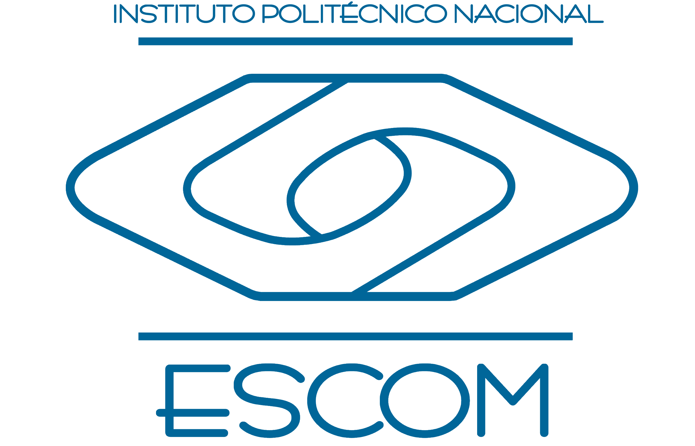
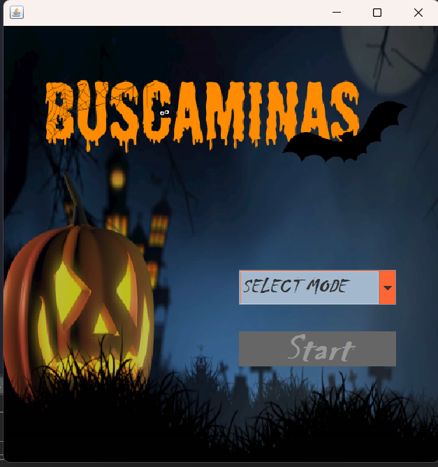

  

<h1 align="center">ESCUELA SUPERIOR DE CÓMPUTO</h1>

---

# Interfaz Gráfica de Buscminas implementando sockets de flujo y comunicación JSON en Java con un servidor en C++.

## Aplicaciones para Comunicaciones en Red

### Profesor:

**Axel Ernesto Moreno Cervantes**

### Elaboró:

- **Serge Eduardo Martínez Ramírez**
- **Alejandra Villegas Gómez**

---

  

